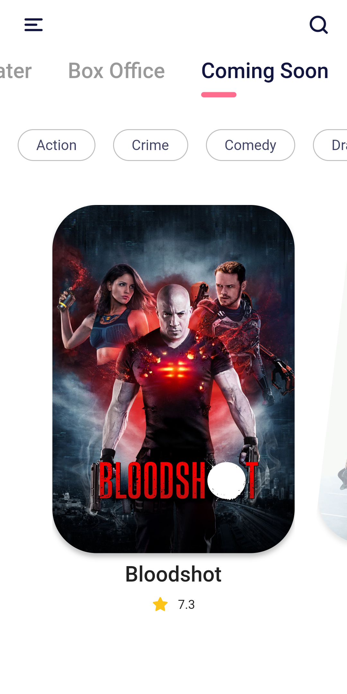
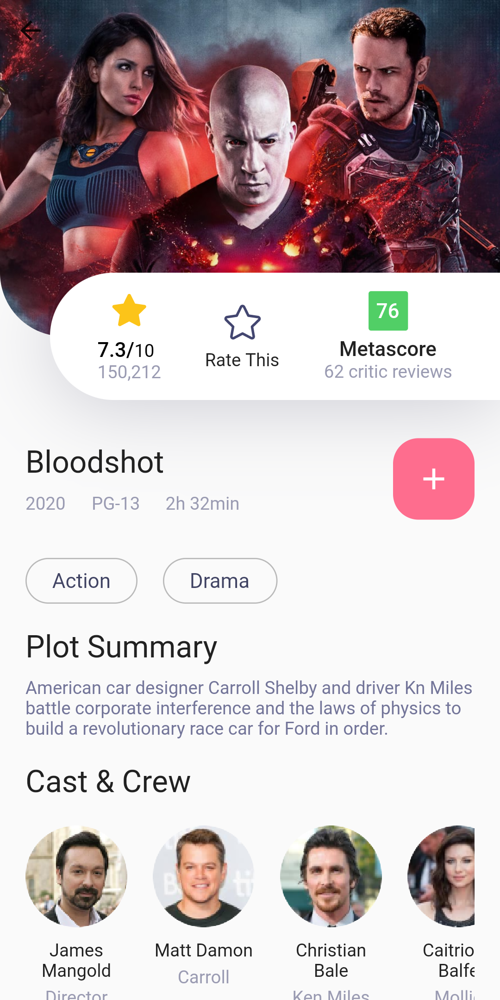

# Flutter Movie App - UI

A new Flutter project.

## **Packages we are using:**

- flutter_svg: [link](https://pub.dev/packages/flutter_svg)
- animations: [link](https://pub.dev/packages/animations)

For help getting started with Flutter, view our
[online documentation](https://flutter.dev/docs), which offers tutorials,
samples, guidance on mobile development, and a full API reference.

### Movie Info App Final UI

## ScreenShots
<table style="width:100%">
  <tr>
    <th>1. Home Screen</th>
    <th>2. Desc Screen</th> 
  </tr>
  <tr>
    <td></td>
    <td></td>
  </tr>
</table>
